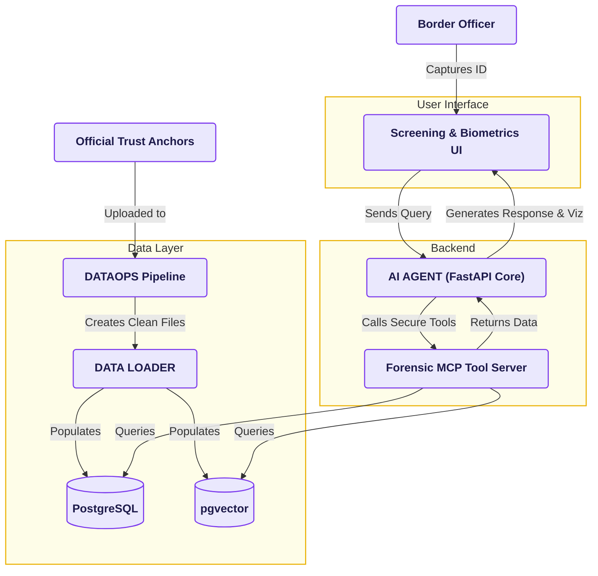

# 🏛️ SIH26188 — System Architecture & Dataflow Diagram

**Project Title:** ThirdEye-SSB — AI-Based Fake Identity & Document Screening System  
**Organization:** Ministry of Home Affairs (MHA) | Sashastra Seema Bal (SSB)  
**Problem Statement ID:** SIH26188  

---

## 📌 Architecture Diagram (Flow & Subgraph Topology)


### 📊 Mermaid Diagram Definition (Identical Aspect Ratio & Dual-Column Layout)



---

## 🔀 Step-by-Step Architecture Dataflow Breakdown

```
  ┌─────────────────────────────────────────────────────────────────────────────────────────────────┐
  │                                     OFFICER & FIELD TERMINAL                                    │
  └────────────────────────────────────────────────┬────────────────────────────────────────────────┘
                                                   │ 1. Captures ID & Face Photo
                                                   ▼
  ┌─────────────────────────────────────────────────────────────────────────────────────────────────┐
  │ [CLIENT LAYER] Desktop Terminal (React 19) / Android Companion (CameraX)                        │
  │ • Real-time Viewfinder HUD, 4-Point Homography Rectification, Offline Store-and-Forward Outbox   │
  └────────────────────────┬───────────────────────────────────────────────▲────────────────────────┘
                           │ 2. Sends Scan Payload                         │ 5. Returns Decision Verdict,
                           │    (Multipart REST / WebSocket)               │    ELA Heatmaps & Certs
                           ▼                                               │
  ┌────────────────────────────────────────────────────────────────────────┴────────────────────────┐
  │ [BACKEND LAYER] Edge AI Screening Engine (FastAPI / Core Orchestrator)                          │
  │                                                                                                 │
  │   ┌─────────────────────────────────────────────────────────────────────────────────────────┐   │
  │   │ 3. Master Pipeline Orchestrator (Async Concurrency Dispatcher)                          │   │
  │   └────────────────────────────┬───────────────────────────────▲────────────────────────────┘   │
  │                                │ Dispatches Parallel           │ Returns Extracted Cues          │
  │                                ▼                               │ & Confidence Scores             │
  │   ┌────────────────────────────────────────────────────────────┴────────────────────────────┐   │
  │   │ Multi-Modal AI Forensic Engines (Parallel Execution)                                    │   │
  │   │  • Stream 1: Multilingual PP-OCRv4, ICAO 7-3-1 MRZ Checksums, UIDAI RSA-2048 PKI       │   │
  │   │  • Stream 2: InsightFace SCRFD-10GF Face Detect + AdaFace 512-D + MiniFASNetV2 FAS      │   │
  │   │  • Stream 3: Adaptive Error Level Analysis (ELA) + DCT DQT + ORB/SSIM Stamp Matcher     │   │
  │   └───────────────┬────────────────────────────┬────────────────────────────┬───────────────┘   │
  └───────────────────┼────────────────────────────┼────────────────────────────┼───────────────────┘
                      │ 4a. Queries PKI Roots      │ 4b. Queries Face Vectors   │ 4c. Writes Audit
                      ▼                            ▼                            ▼
  ┌─────────────────────────────────────────────────────────────────────────────────────────────────┐
  │ [SOVEREIGN DATA LAYER] Air-Gapped High-Security Data & Persistence Storage                      │
  │                                                                                                 │
  │   ┌──────────────────────────┐   ┌──────────────────────────┐   ┌───────────────────────────┐   │
  │   │ UIDAI & ICAO PKI Roots   │   │ pgvector Watchlist &     │   │ PostgreSQL & BLAKE3       │   │
  │   │ (RSA-2048 / ECDSA-P256   │   │ SSB Official Stamp       │   │ Cryptographic Tamper-     │   │
  │   │ X.509 Trust Anchors)     │   │ Template Registry        │   │ Evident Audit Ledger      │   │
  │   └──────────────────────────┘   └──────────────────────────┘   └───────────────────────────┘   │
  └─────────────────────────────────────────────────────────────────────────────────────────────────┘
```

---

## 🏢 Layer-by-Layer Architectural Specifications

### 1. Client & Interface Layer
* **Desktop Screening Station (Primary Booths):** React 19, TypeScript, TailwindCSS, and Tauri 2.0 shell. Includes official UIDAI/SSB design styling, Web Speech API screen reader, live connected field device telemetry (`DeviceTracker`), and alpha-blended forensic heatmap canvas.
* **Android Field Companion (Roving Foot Patrols):** Kotlin, Jetpack Compose, CameraX, Room SQLite encrypted outbox with zero-drop exponential backoff synchronization.

### 2. Edge AI Screening Backend
* **Master Pipeline Orchestrator:** FastAPI asynchronous controller that ingests multi-part scan requests and dispatches them across non-blocking worker threads.
* **Stream 1 (Optical & Crypto):** Multilingual PP-OCRv4 (DBNet++ / SVTR-LCNet), ICAO Doc 9303 Modulo-10 checksum engine, and offline UIDAI RSA-2048 PKI validator with JPEG-2000 face extractor.
* **Stream 2 (Biometrics & FAS):** InsightFace SCRFD-10GF face detection, 5-point Umeyama affine normalization, AdaFace-ResNet100 512-D unit cosine matcher, and MiniFASNetV2-SE dual-scale anti-spoofing.
* **Stream 3 (Deep Forensics):** Adaptive Error Level Analysis (ELA at $Q=90, 95$), Discrete Cosine Transform ($8 \times 8$ DQT) quantization grid analysis, photo splice boundary gradient detector, and 4-stage ORB/SSIM border stamp verifier.
* **Two-Stage Hybrid Bayesian Risk Engine:** Combines Stage 1 deterministic hard tripwires (instant RED interdiction on cryptographic or biometric breach) with Stage 2 multi-factor log-odds posterior scoring with continuous noise deadbands ($\psi_{\text{tamper}}, \psi_{\text{live}}, \psi_{\text{face}}$).

### 3. Sovereign Data & Cryptographic Layer
* **PKI Trust Store:** Offline storage of public X.509 root authority certificates for instant digital signature verification.
* **pgvector Watchlist & Stamp Registry:** High-speed HNSW index for sub-millisecond 512-D cosine vector similarity search against national blacklists and official SSB checkpoint stamp templates.
* **BLAKE3 Cryptographic Audit Ledger:** Ephemeral RAM-only processing adhering to DPDP Act 2023 zero-retention principles, recording only cryptographically chained SHA-256 / BLAKE3 transaction proofs for court admissibility under Bharatiya Nyaya Sanhita (BNS 2023) and Bharatiya Sakshya Adhiniyam (BSA 2023 Sec 63).
